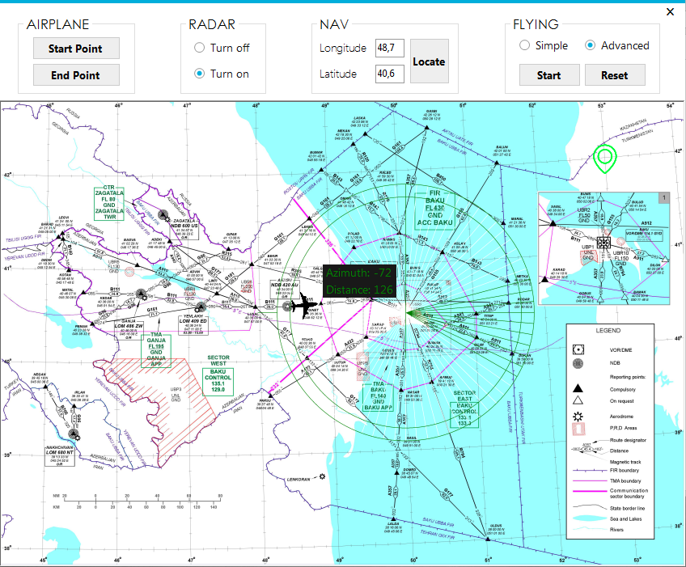

# The project made at National Aviation Academy for Graduating Work. The program simulates an airplane flight. There are two modes, simple and advanced. In the first mode, the plane flies in a straight line from the start point to the end point, in the second mode, the plane flies to the end point along air routes, where the shortest path is calculated using the Dijkstra algorithm. The program shows the latitude and longitude of the aircraft, as well as the distance and azimuth to Heydar Aliyev airport when flying in the radar zone.

